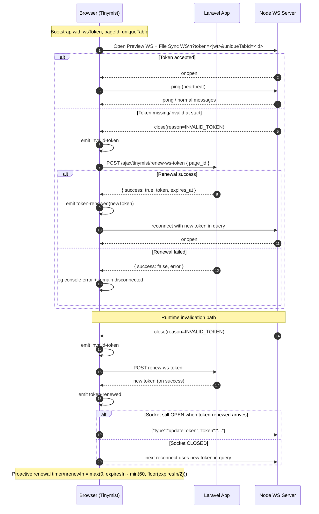

# Tinymist WebSocket Authentication Flow

This document explains how Tinymist authenticates WebSocket connections and keeps authentication valid over time.

## Why Authentication Works (Secret + Claims)

Authentication is based on signed JWTs. The browser does not mint tokens; Laravel does.

### Required environment configuration

The signing key must be configured in environment and shared by the PHP app and Node WebSocket services:

```env
TINYMIST_WS_SECRET=replace-with-strong-random-secret
TINYMIST_WS_TOKEN_TTL=900
```

- `TINYMIST_WS_SECRET`
  - Loaded by Laravel config (`tinymist.ws_token_secret`).
  - Used to sign JWT (`HS256`) in `TinymistPreviewManager`.
  - Also loaded by Node WebSocket servers to verify the token signature.
- `TINYMIST_WS_TOKEN_TTL`
  - Loaded by Laravel config (`tinymist.ws_token_ttl`, default `900` seconds).
  - Effective token lifetime is at least 60s (`exp = iat + max(ttl, 60)`).

If `TINYMIST_WS_SECRET` is missing, Laravel token generation fails, and WebSocket auth cannot succeed.

### Token payload (what the token bears)

Laravel issues a JWT payload with these claims:

- `user_id`: current authenticated BookStack user ID.
- `page_id`: page being edited/previewed.
- `iat`: issued-at Unix timestamp.
- `exp`: expiry Unix timestamp.

Header/algorithm:

- JWT header is `{"alg":"HS256","typ":"JWT"}`.
- Signature is HMAC-SHA256 over `base64url(header).base64url(payload)` using `TINYMIST_WS_SECRET`.

### Verification and authorization chain

1. **Issuance**
    - Laravel builds token in `TinymistPreviewManager::generateTinymistWsToken`.
2. **Renewal authorization**
    - `POST /ajax/tinymist/renew-ws-token` checks:
        - page exists,
        - user has `page-update` permission,
        - then returns a fresh token.
3. **Node verification**
    - Node verifies JWT signature and expiry with the same `TINYMIST_WS_SECRET`.
    - File-sync server also validates page scope on token updates.

### Important current behavior

- File-sync WebSocket strictly enforces JWT verification and returns close reason `INVALID_TOKEN` on auth failure.
- Preview bridge socket currently routes by `pageId`; token is still sent by the browser, but this bridge path does not currently enforce JWT verification in the same way as file-sync. Preview bridge spawns new process for every page, restarting it takes time and resources.

## Flow Diagram

```mermaid
flowchart TD
    A[Page bootstraps TinymistApp with wsToken + pageId from backend(Laravel), creates uniqueTabId] --> B[ConnectionsManager creates TinymistTokenManager]
    B --> C{wsToken present?}

    C -- Yes --> D[Create websockets Preview + FileSyncLSP]
    C -- No --> E[Emit invalid-token event]

    E --> F[TokenManager renewToken via POST /ajax/tinymist/renew-ws-token with page_id to backend(Laravel)]
    F --> G{Renewal success?}
    G -- No --> H[Log error + remain disconnected]
    G -- Yes --> I[Emit token-renewed(newToken)]

    D --> J[Each WS client connect builds URL with token + uniqueTabId]
    I --> J
    J --> K[Open WebSocket]
    K --> L{onopen?}

    L -- Yes --> M[Mark status connected + start ping heartbeat]
    L -- No --> N[Status disconnected + reconnect backoff]

    M --> O{Socket closes with reason INVALID_TOKEN?}
    O -- No --> P[Normal runtime]
    O -- Yes --> Q[Emit invalid-token]
    Q --> F

    I --> R[WS clients update local token]
    R --> S{Socket currently OPEN?}
    S -- Yes --> T[Send JSON message: updateToken]
    S -- No --> U[Use new token on next connect]

    M --> V[TokenManager schedules proactive renewal]
    V --> W[renewIn = max(0, expiresIn - min(60, floor(expiresIn/2)))]
    W --> F
```

## Sequence Diagram



## Components Involved

- `TinymistApp` gets `wsToken`, `pageId` from initial page load, and generated `uniqueTabId` to the connection layer.
- `TinymistConnectionsManager` owns socket startup order and token propagation to both channels.
- `TinymistTokenManager` is the source of truth for token renewal and expiry scheduling.
- `TinymistWebSocketClient` (base class for both sockets) handles authenticated URL construction, reconnects, and live token updates.

## End-to-End Sequence

1. **Bootstrap**
   - App initializes with `wsToken` from page options.
   - Connection manager creates token manager and socket clients.

2. **Authenticated connect**
   - Each WS URL is built as:
      - local: `ws(s)://<hostname>:<localPort>?token=<jwt>&uniqueTabId=<id>`
      - remote: `ws(s)://<host>/<remotePath>?token=<jwt>&uniqueTabId=<id>`
   - Both preview and file-sync sockets authenticate with that token query parameter.

3. **Runtime validity checks**
   - If server rejects auth and closes socket with reason `INVALID_TOKEN`, client emits `invalid-token`.
   - Token manager calls renewal endpoint and emits `token-renewed` on success.

4. **Token propagation**
   - WS clients receive `token-renewed` and replace in-memory token.
   - If socket is already open, client sends `{ "type": "updateToken", "token": "..." }` to node server.
   - If socket is closed, token is used on next reconnect attempt.

5. **Proactive renewal**
    - Token manager decodes JWT payload (`exp`) and schedules refresh before expiry.
    - Renewal runs at `renewIn = max(0, expiresIn - min(60, floor(expiresIn / 2)))`.
    - This means: refresh 60 seconds early, or halfway through for very short-lived tokens.

## Failure/Recovery Behavior

- Renewal API failure does **not** crash app; it logs errors and waits for next trigger.
- Socket-level failures still use reconnect backoff independently.
- Missing startup token is recoverable: manager emits `invalid-token`, renewal fetches a new token, and startup retries after `token-renewed`.

## Event-Level Contract (Auth-Relevant)

- `invalid-token`: signal that current token cannot be used.
- `token-renewed`: new JWT is available and should be applied immediately.
- `status`: per-socket connected/disconnected health updates.
- socket close reason `INVALID_TOKEN`: bridge from transport failure to auth-renew flow.
